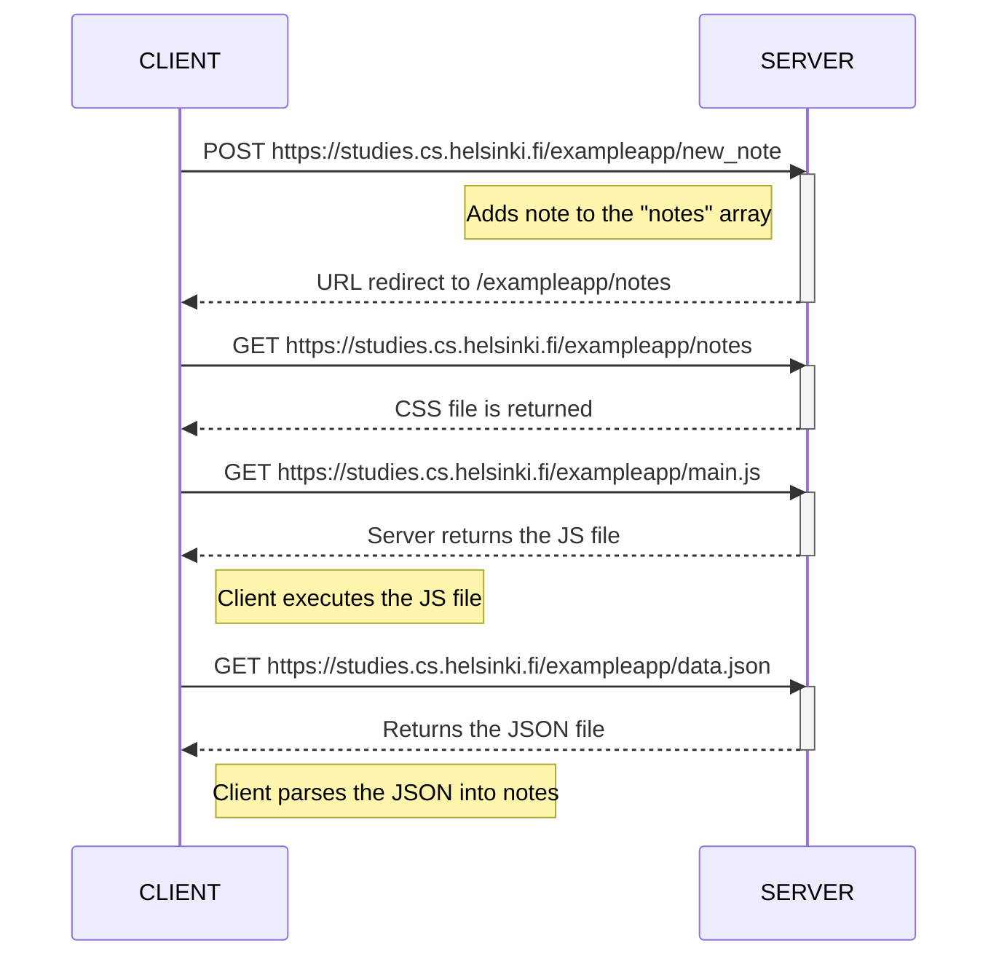

```mermaid
sequenceDiagram
CLIENT->>SERVER: POST https://studies.cs.helsinki.fi/exampleapp/new_note
activate SERVER
note LEFT of SERVER: Adds note to the "notes" array
SERVER-->>CLIENT: URL redirect to /exampleapp/notes
deactivate SERVER
CLIENT->>SERVER: GET https://studies.cs.helsinki.fi/exampleapp/notes
activate SERVER
SERVER-->>CLIENT: CSS file is returned
deactivate SERVER
CLIENT->>SERVER: GET https://studies.cs.helsinki.fi/exampleapp/main.js
activate SERVER
SERVER-->>CLIENT: Server returns the JS file
deactivate SERVER
note right of CLIENT: Client executes the JS file
CLIENT->>SERVER: GET https://studies.cs.helsinki.fi/exampleapp/data.json
activate SERVER
SERVER-->>CLIENT: Returns the JSON file
deactivate SERVER
note right of CLIENT: Client parses the JSON into notes
```
