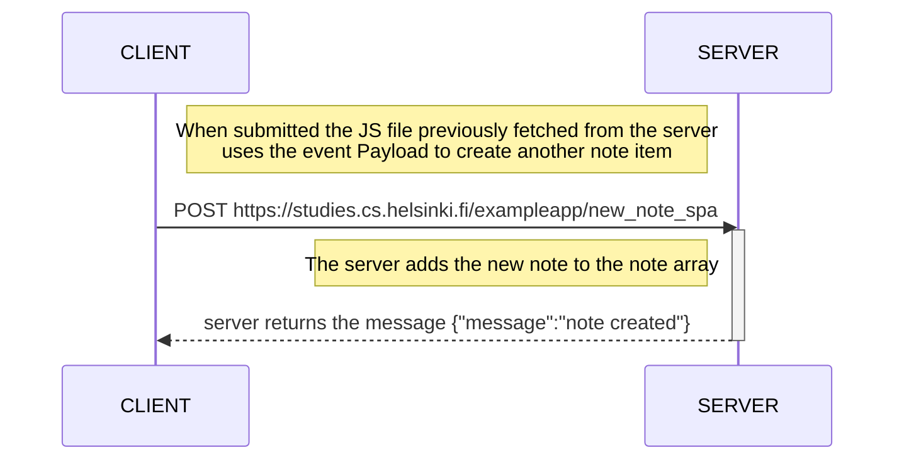

```mermaid
sequenceDiagram
note right of CLIENT: When submitted the JS file previously fetched from the server <br/> uses the event Payload to create another note item
CLIENT->>SERVER: POST https://studies.cs.helsinki.fi/exampleapp/new_note_spa
activate SERVER
note left of SERVER: The server adds the new note to the note array
SERVER-->>CLIENT: server returns the message {"message":"note created"}
deactivate SERVER
```
