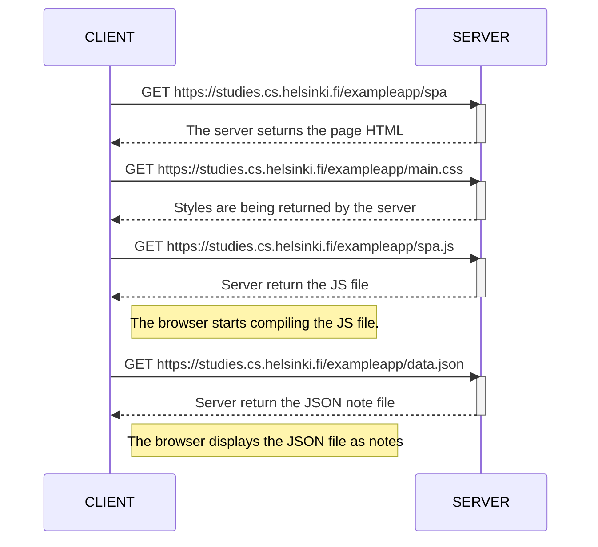

```mermaid
sequenceDiagram
    CLIENT->>SERVER: GET https://studies.cs.helsinki.fi/exampleapp/spa
    activate SERVER
    SERVER-->>CLIENT: The server seturns the page HTML
    deactivate SERVER
    CLIENT->>SERVER: GET https://studies.cs.helsinki.fi/exampleapp/main.css
    activate SERVER
    SERVER-->>CLIENT: Styles are being returned by the server
    deactivate SERVER
    CLIENT->>SERVER: GET https://studies.cs.helsinki.fi/exampleapp/spa.js
    activate SERVER
    SERVER-->>CLIENT: Server return the JS file
    deactivate SERVER
    note right of CLIENT: The browser starts compiling the JS file.
    CLIENT->>SERVER: GET https://studies.cs.helsinki.fi/exampleapp/data.json
    activate SERVER
    SERVER-->>CLIENT: Server return the JSON note file
    deactivate SERVER
    note right of CLIENT: The browser displays the JSON file as notes

```
